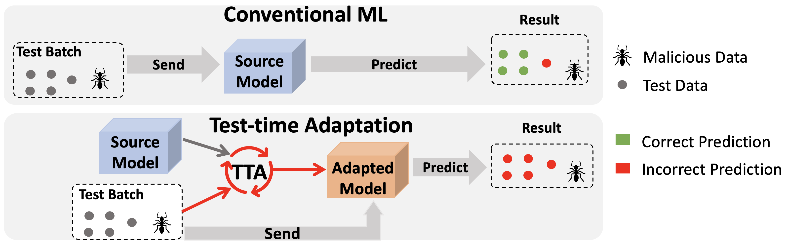

# Uncovering Adversarial Risks of Test-Time Adaptation
[<span style="font-size:16px">Tong Wu</span>](https://tongwu2020.github.io/tongwu)<sup style="font-size:12px">1</sup>,
[<span style="font-size:16px">Feiran Jia</span>](https://scholar.google.com/citations?user=haBpKDQAAAAJ&hl=en)<sup style="font-size:12px">2</sup>,
[<span style="font-size:16px">Xiangyu Qi</span>](https://unispac.github.io/)<sup style="font-size:12px">1</sup>,
[<span style="font-size:16px">Jiachen T. Wang</span>](https://tianhaowang.netlify.app/)<sup style="font-size:12px">1</sup>,
[<span style="font-size:16px">Vikash Sehwag</span>](https://vsehwag.github.io/)<sup style="font-size:12px">1</sup>,
[<span style="font-size:16px">Saeed Mahloujifar</span>](https://smahloujifar.github.io/)<sup style="font-size:12px">1</sup>,
[<span style="font-size:16px">Prateek Mittal</span>](https://www.princeton.edu/~pmittal/)<sup style="font-size:12px">1</sup>

Princeton University <sup style="font-size:10px">1</sup>, &nbsp;
Penn State University<sup style="font-size:10px">2</sup> 

### ICML 2023

[[Paper]](https://arxiv.org/abs/2301.12576)



<span style="font-size:13px">Test-time Adaptation (TTA), where a model is modified based on the test data it sees, has been a promising solution for distribution shift. This paper demonstrates that TTA is subject to novel security risks, where malicious test data can cause predictions about clean and unperturbed data to be incorrect. This suggests that adaptive model (model relies on the interaction of test inputs) have yet another attack vector that can be exploited. [<a href="https://newsletter.mlsafety.org/i/103568981/adaptive-models-can-be-exploited-by-adversaries">Source</a>]</span>


## Requirements
The code is tested with Python 3.8 and PyTorch 1.13.1. The code should be compatible with other versions of packages. For other packages, use `pip install -r requirement.txt`

## Datasets
You need to download the CIFAR-C and ImageNet-C data to `../data/`. 
Some CIFAR-C and ImageNet-C's models are auto downloaded from RobustBench. 
More configs can be found in `conf.py` (Attacking options)

## Usage

Examples for running code for ImageNet-C 

```
python imagenet_test_attack.py --cfg cfgs/imagenetc/tent.yaml MODEL.ARCH Standard_R50  ATTACK.TARGETED True DATA_DIR "../data" CORRUPTION.SEVERITY [3]  
```

Examples for running code for CIFAR-C 

```
python cifar_test_attack.py --cfg cfgs/cifar10_wrn_PGD/tent.yaml MODEL.ARCH Standardwrn28  ATTACK.TARGETED True DATA_DIR "../data" CORRUPTION.SEVERITY [3]  
```


## Credits  
This code has been built upon the code accompanying the papers

"Tent: Fully Test-time Adaptation by Entropy Minimization" at https://github.com/DequanWang/tent. 

"Test-time Adaptation via Conjugate Pseudo-Labels" at https://github.com/locuslab/tta_conjugate.git. 

## Questions
If anything is unclear, please open an issue or contact Tong Wu (tongwu@princeton.edu).
